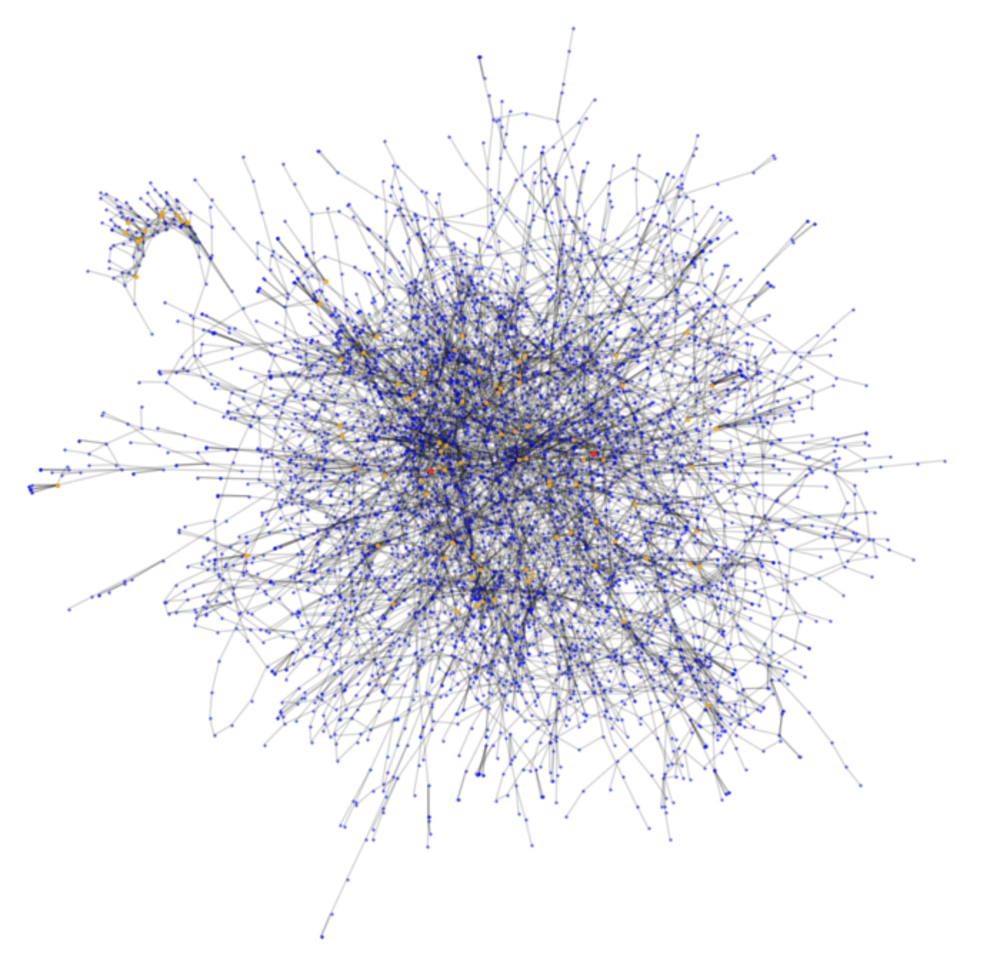

# Western United States Power Grid Analysis

Analyzing the complex network modeling the Western United States power grid. Aiming to understand its structural vulnerabilities, increase resilience against unexpected disruptions, and ensure a more reliable and stable power grid.

## Data Description

The nodes in this network represent power stations, while the edges symbolize the transmission lines connecting these stations. By studying this network, we hope to understand the impact of various failure scenarios and improve our knowledge of critical infrastructure networks.

## Research Questions

The core inquiry of our analysis:
> Which nodes in the network are most critical to its overall stability and efficiency?

## Network Analysis

- **Network and Distribution Properties**
  - Number of Nodes and Edges
  - Network Density
  - Degree Distribution
  - Assortativity
  - Triangle Analysis
  - Average Clustering Coefficient
  - Transitivity
  - Maximum k-core and Maximum Clique
  
- **Path Analysis**
  - Diameter
  - Average Shortest Path
  - Connected Component Analysis
  
- **Model Comparisons**
  - Erdős–Rényi (ER)
  - Watts–Strogatz (WS)
  - Barabási–Albert (BA)
  
- **Centrality Analysis**
  - Degree Centrality
  - Closeness Centrality
  - Betweenness Centrality
  - Eigenvector Centrality
  - PageRank
  - Katz Centrality
  - Harmonic Centrality
  
- **Failure Analysis**
  - Random Failure Resilience
  - Centrality-Based Failure Impact
  - Impact of Articulation Points and Bridges
  
## Key Findings

Our findings reveal the network's sparse nature and few hub nodes. While it demonstrates resilience to random failures, targeted disruptions on critical nodes could substantially hinder network connectivity. 

